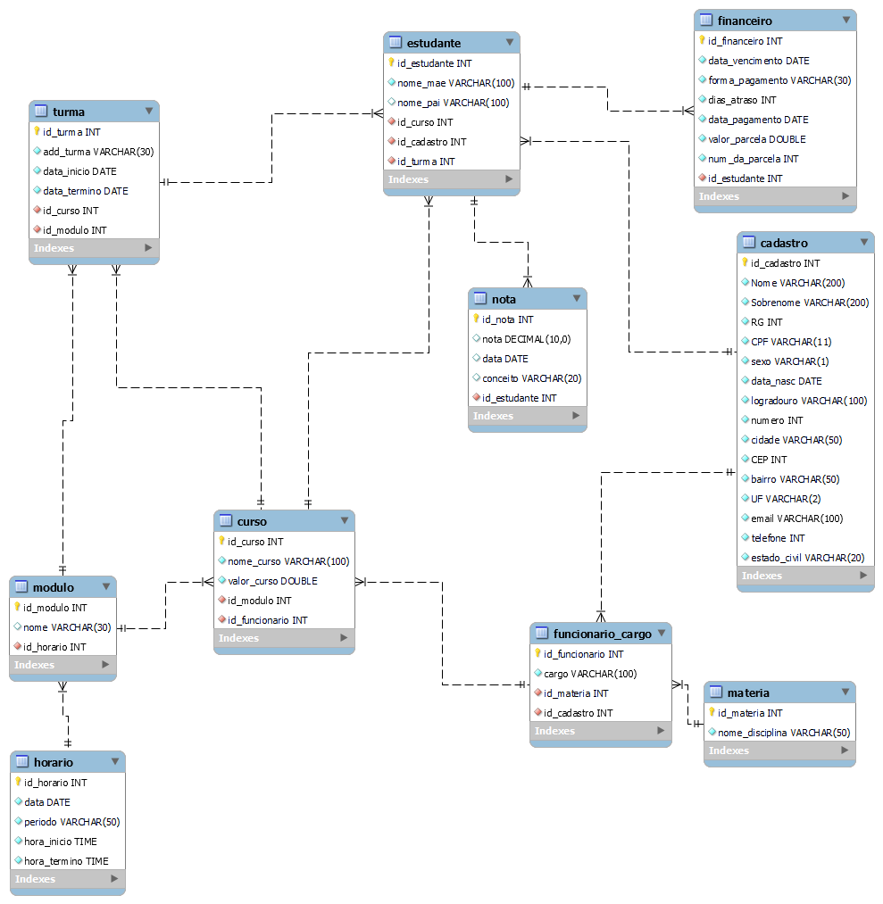

# Banco de Dados "Resilia" 

## Visão Geral

Bem-vindo ao projeto de Banco de Dados "Resilia". Este sistema foi desenvolvido para atender às demandas de uma instituição educacional, possibilitando a gestão eficiente de informações relacionadas a cadastros, cursos, turmas, notas, horários e aspectos financeiros.

## Requisitos

Antes de executar os scripts, verifique se você possui os seguintes requisitos instalados:

- Sistema Gerenciador de Banco de Dados (SGBD): Os scripts foram projetados para serem executados em um SGBD compatível. Recomendamos o uso do MySQL Workbench.
- Cliente SQL: Utilize um cliente SQL compatível com o seu SGBD para executar os scripts.

## Instruções de Configuração

Siga as etapas abaixo para criar e configurar o banco de dados "Resilia":

### Criação do Banco de Dados:

1. Abra o seu cliente SQL e conecte-se ao servidor do SGBD.
2. Execute o script `Resilia.sql` para criar o banco de dados "Resilia" juntamente com suas tabelas.
3. Em seguida execute o script `alters.sql` para alteração das tabelas incluindo as chaves estrangeiras associando as relações das entidades.

### Inserção de Dados (Opcional):

Se desejar, você pode adicionar dados de exemplo ao banco de dados:

1. Execute o script `inserts.sql` para inserir registros de exemplo nas tabelas.
2. Os scripts de `perguntas.sql` e `view.sql` trazem resultados de perguntas/consultas no banco de dados.

## Descrição das Tabelas

Aqui está uma breve descrição das tabelas presentes no banco de dados:

- **Cadastro**: Armazena detalhes de cadastro de indivíduos, incluindo informações pessoais e de contato.
- **Materia**: Registra as disciplinas oferecidas.
- **Estudante**: Mantém informações sobre os estudantes matriculados.
- **Turma**: Controla as turmas disponíveis, suas datas de início e término.
- **Modulo**: Armazena os módulos oferecidos.
- **Curso**: Contém informações sobre os cursos disponíveis e seus valores.
- **Financeiro**: Registra detalhes financeiros, como datas de vencimento e valores de parcelas.
- **Nota**: Mantém registros de notas, datas e conceitos.
- **Funcionario_Cargo**: Armazena os funcionários da instituição e seus cargos.
- **Horario**: Controla os horários das atividades.

## Utilização

O banco de dados "Resilia" foi projetado para fornecer um ambiente de gerenciamento de informações educacionais. Use consultas SQL para acessar e manipular os dados conforme necessário.

Lembre-se de manter backups regulares do banco de dados e seguir boas práticas de segurança para evitar a perda de dados importantes.

## Contribuições e Manutenção

Este documento oferece uma visão geral do banco de dados "Resilia". Para manutenção, consultas avançadas e outros detalhes, entre em contato com a equipe responsável pela gestão do banco de dados. Mantenha este documento atualizado à medida que ocorrerem mudanças no sistema e nas necessidades da instituição.

Este guia serve como um ponto de partida; adicione informações específicas e detalhes de implementação conforme necessário para garantir uma compreensão completa do sistema.

## Observações

- Após a criação do banco de dados foi feita a engenharia reversa para obter o diagrama direto pelo MySQL Workbench.

- Temos alguns gráficos fornecidos através de consultas utilizando a ferramenta Power BI para obter resultados de dados em informações valiosas, do desempenho dos estudantes, eficácia dos cursos e saúde financeira. 
Aqui tem alguns exemplos dos gráficos extraido através dos dados:

[Notas dos estudantes.](./graficos/notas%20dos%20estudantes.pdf)
[Porcentagem de aprovados.](./graficos/porcentagem%20de%20aprovados.pdf)
[Situação de alunos](./graficos/SITUAÇÃO%20DE%20ALUNOS.pdf)
[Pagamentos](./graficos/grafico%20de%20pagamentos..pdf)